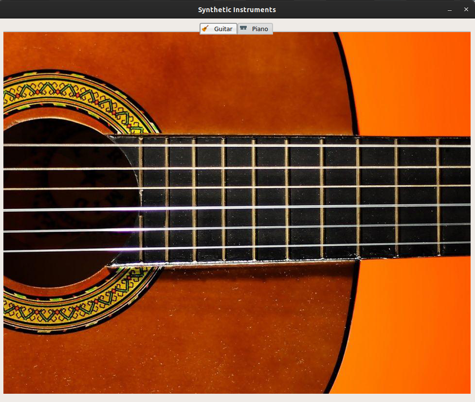
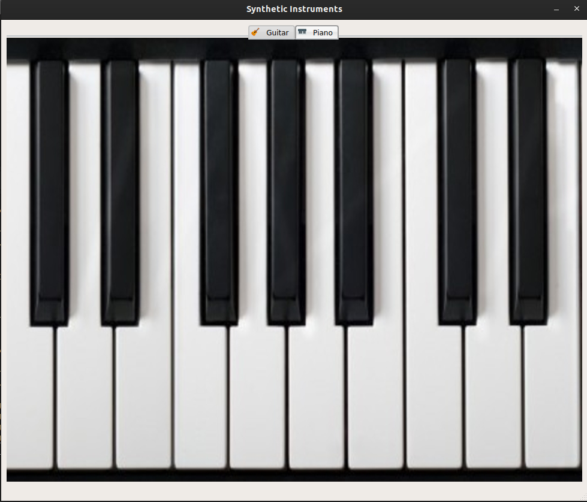

# Synthetic Instruments 

Synthetic Instruments is a basic application for playing a few basic musical instruments .

Instruments included : 

- Guitar (basic)
- Piano (17 keys)

**Important Note**

You'll need to close any application that might be using your sound card to ensure application's smooth performance.

**Dependencies**

- simpleaudio .. included in setup.ps1

## <u>Synthesis</u>

Process of generating a Guitar/Piano sounds are included in Synthesis.py, each instrument follow a certain algorithm for which we implemented or used, some the algorithms implemented were very slow like the one implemented in `guitar_note` which is a very time consuming algorithm compared to the `karplus_strong` algorithm which generate sounds in short time. Piano notes were generated with a combinations of a simple sine waves with some modifications to output to ensure saturation, quality and range. 

All outputs are then modified to be played by a regular 16-bit sound card mapping all results to the 16-bit range to ensure a quality sound.

## <u>Basic Usage</u>

The application`s main screen consists of two tabs for each instrument, simply switch to desired device and click on strings/keys.

